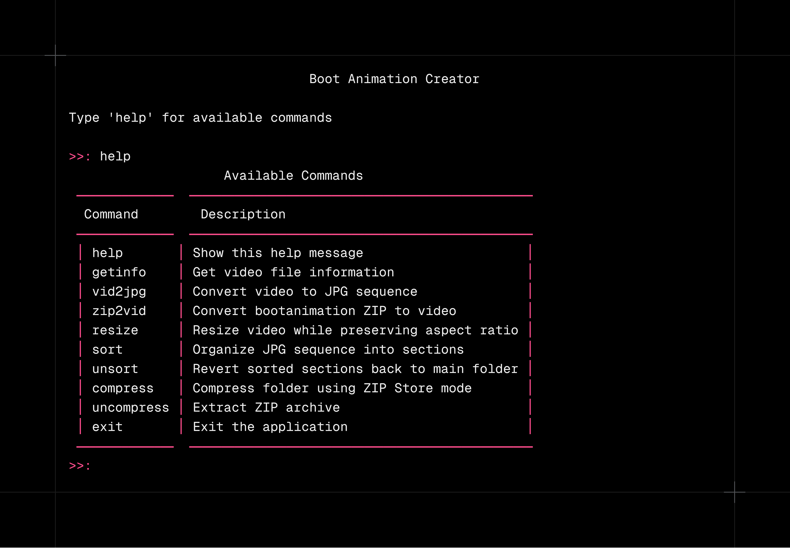

# BootAnimix

Welcome to **BootAnimix**, a delightful Python-based application for transforming videos and images into elegant boot animations. Whether you’re looking to convert videos into frame-by-frame image sequences, organize them into sections, resize videos, or compress/uncompress archives, BootAnimix has you covered in a friendly and visually appealing way!



## Table of Contents

- Key Features
- Installation
- Quick Start
- Commands Overview
- How It Works
- Contributing
- License

---

## Key Features

- **Convert Videos to JPG**: Easily extract frames from your video files.
- **Organize & Sort Frames**: Group and sort frames into sections with loop counts.
- **Resize Videos**: Adjust your video’s width or height while preserving aspect ratio.
- **Compress & Uncompress**: Store files in a ZIP archive or extract existing ones.
- **Generate Boot Animation**: Turn a bootanimation-like ZIP archive into an MP4 file.

---

## Installation

1. Clone or download this repository.

2. Navigate to the project folder in your terminal:

   ```bash
   cd bootanimix
   ```

3. Install the required dependencies:

   ```bash
   pip install -r requirements.txt
   ```

Termux Installation (Single step):

```bash
pkg update; pkg upgrade -y; pkg install git python -y; pkg install python-numpy python-pillow ffmpeg uv -y; git clone https://github.com/bootanimix/script; cd script; uv pip install -r requirements.txt --system; python main.py
```

---

## Quick Start

1. Run the main application:

   ```bash
   python main.py
   ```

2. Type in any command listed below, or simply type **help** to see them all.

---

## Commands Overview

- **help** – Display helpful information about commands.
- **getinfo** – Show video metadata, including duration and dimensions.
- **vid2jpg** – Convert a video to JPEG frames.
- **zip2vid** – Create an MP4 video from a bootanimation ZIP.
- **resize** – Change the resolution of a video without losing aspect ratio.
- **sort** – Organize image frames into sections.
- **unsort** – Revert your sorted frames back to a single folder.
- **compress** – Archive a folder into a ZIP using store mode.
- **uncompress** – Extract an existing ZIP archive.
- **exit** – Quit the application gracefully.

---

## How It Works

1. **Interactive Prompts**: Enter file paths or select options as guided by the terminal prompts.
2. **Progress Bars**: Enjoy real-time feedback on conversions and resizing tasks.
3. **Customizable Sections**: Create boot animation sections with optional looping.
4. **Seamless Cleanup**: Unsort or revert changes quickly if something goes wrong.

---

## Contributing

Contributions and suggestions are always welcome. Feel free to open an issue or submit a pull request on GitHub. Together, we can make BootAnimix even more delightful!

---

## License

Feel free to use, modify, and distribute BootAnimix in accordance with the terms of the license provided in this repository.

---

Enjoy creating fantastic boot animations and dynamic video transformations with **BootAnimix**! If you have any feedback or encounter any issues, please reach out or open an issue. Happy booting!
